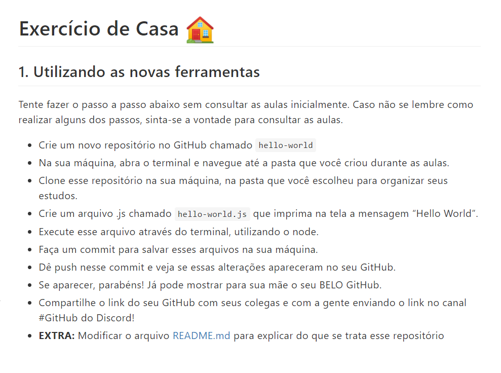

<h1 align='center'> Exercício de Casa 🏠 </h1>

## | Descrição |

## | Techs |

  

## | Sobre mim |

Me chamo Larissa Lavínia, tenho 23 anos e sou de Salvador-Ba. 

O que desperta minha paixão pela programação é poder encontrar soluções práticas para os problemas. Gosto de ser desafiada positivamente porque assim me desenvolvo como profissional. 

Autonomia e disciplina foram habilidades que desenvolvi estudando remotamente, tenho facilidade para trabalhar em equipe e comprometimento com os meus objetivos.